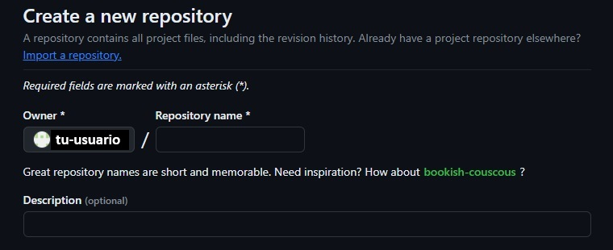

# Necesario para trabajar en GitHub
<p>Debes tener una cuenta de GitHub para poder hacer repositorios. Nuestro proyecto inicial se creó en astro y le dijimos que nos inicializase un nuevo repositorio de Git. Si no lo hubiesemos hecho habria que ejecutar este comando</p>

```bash
    git init
```

## Crear un repositorio
<p>Usamos el boton de crear un nuevo repositorio en GitHub, le damos nombre, descripcion, publico normalmente ya que los provados solo podremos hacerlos con una cuenta de pago, podemos crearle directamente un README para informar del uso, proposito o funcionamiento de nuestro repositorio, crearle un archivo gitignore si no lo hemos hecho al crear el proyecto y elegir una licencia para decir que se puede o que no se puede hacer con nuestro codigo. Una vez elegido pulsamos el boton de "Create repository".</p>



<p>Una vez creado el repositorio, podemos dar la orden de añadir el destino remoto de nuestro repositorio a nuestro proyecto local.</p>

```bash
    git remote add origin https://github.com/nombreusuariogit/nombrerepositoriogit.git
```
<p>Ahora la palabra origin equivale a la url del repositorio remoto. Una vez añadida la direccion a a la que apunta el repositorio, vamos a renombrar nuestra rama master, creada por defecto, por un nombre mas adecuado al estandar actual, y la llamaremos rama main.</p>

```bash
    git branch -M main
```
<p>Hacemos un commit inicial con un mensaje para que cuando seguidamente subamos el contenido al repositorio, la orden push tenga contenido que enviar al repositorio, sin el commit, estariamos mandando basicamente nada y nos daria error.</p>

```bash
    git commit -m "Primer commit del proyecto"
```
<p>Finalmente hacemos el pusheo de nuestro proyecto para que Git guarde su contenido.</p>

```bash
    git push -u origin main
```
<p>Una vez aqui ya solo tienes que pushear cuando tengas cambios significativos a tu repositorio de Git y asi tenerlo al dia.</p>

## Otros comandos utiles de Git
### Ver estado del stage o proyecto
<p>El comando git status en Git se utiliza para mostrar el estado actual del repositorio. Proporciona información sobre los cambios que se han realizado en los archivos del repositorio y el estado de estos cambios en relación con el área de trabajo, el área de preparación y el repositorio local.</p>

```bash
    git status
```

### Añadir archivos o cambios al stage
<p>El comando git add . se utiliza en Git para agregar todos los archivos modificados y nuevos en el directorio de trabajo al área de preparación (también conocida como "staging area"). Esto significa que los archivos que han sido modificados o creados se preparan para ser incluidos en el próximo commit. El "." en el comando hace referencia a todos los archivos en el directorio actual, o sea, el de trabajo, ya que los comandos de git los hacemos desde la raiz del proyecto.</p>

```bash
    git add .
```

## Practicas comunes en el desarrollo
<p>Una vez tengamos una version estable o inicial en Git, el estandar de programacion recomienda crear otra rama en nuestro proyecto sobre la que podremos trabajar sin afectar a la rama principal que hemos subido a Git y es estable. Una vez lleguemos a ciertos hitos en nuestro codigo juntaremos nuestra rama de desarrollo con la rama principal del proyecto, y volveremos a crear una nueva rama de desarrollo para continuar nuestras modificaciones posteriores. Para ello creamos nuestra primera rama llamada "dev" a partir de la rama main y trabajaremos sobre dev hasta que consideremos que tenemos cambios significativos en el proyecto y ahi es cuando uniremos nuestras ramas.</p>

```bash
    git checkout -b dev
```